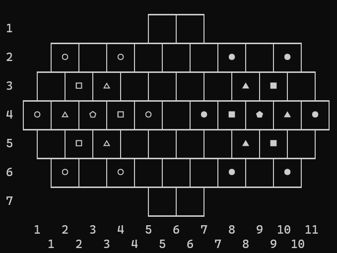
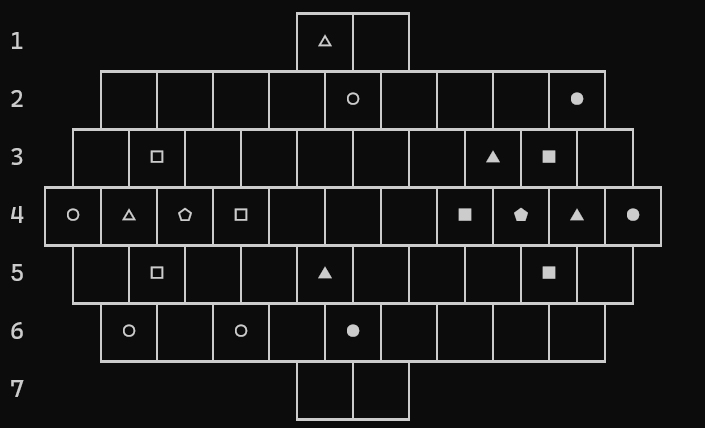
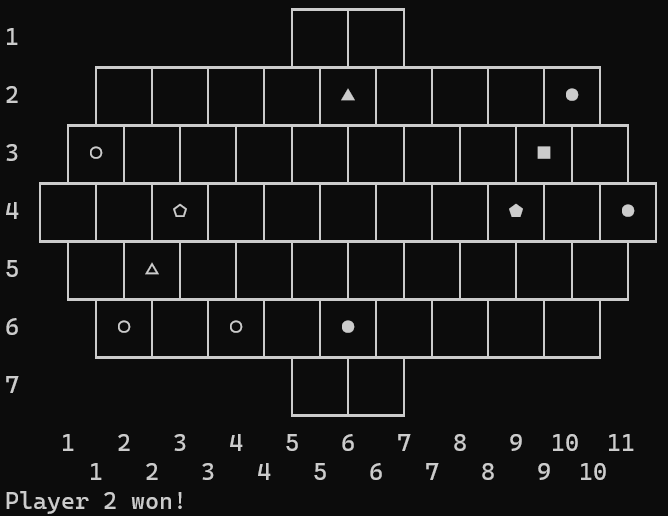
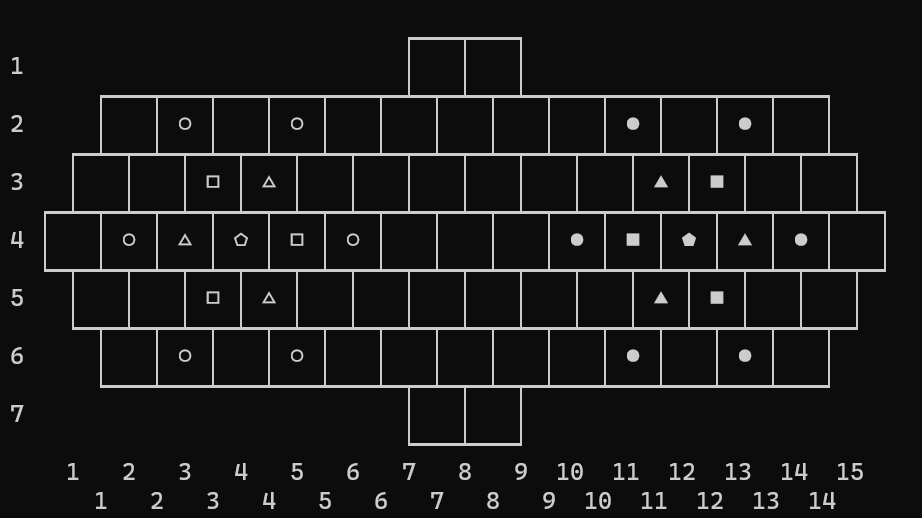

# PFL Project 1 - Tactigon

The game is called `Tactigon` and it can be found and explored in [tactigongame.com](https://tactigongame.com/)

## 1. Group Tactigon_5

|               Name                |  Number   | Contribution (%) |
| :-------------------------------: | :-------: | :--------------: |
|    Félix Marcial Alves Martins    | 202108837 |  55   |
| Marco Filipe Gonçalves Vilas Boas | 202108774 |  45   |

## 2. Installation and execution

The only requirement to run our game, besides SICStus Prolog, is to run the program in the terminal and not the GUI. This is because some of the characters we use are not monospaced in the GUI, which makes the board not be displayed correctly.

## 3. Game description

### 3.1 Pieces

Each player starts with a pentagon, 3 squares, 3 triangles and 6 circles.
The pieces move according to their number of sides and in any direction (i.e. movement does not need to be in a straight line). Pieces cannot normally jump other pieces.

- Circle: Moves 1 space
- Triangle: Moves 3 spaces
- Square: Moves 4 spaces
- Pentagon: Moves 5 spaces

Attacks from different pieces have 3 possible outcomes:

- The attacked piece gets captured
- Both the attacker and the attacked get captured
- The attacker cannot actually attack the other piece (this is considered an invalid move)

Here we present in text the interactions between all the pieces in relation to how they can attack each other, and what outcomes arise from such attacks.

For clarification, the rows represent the attacking piece, and the columns represent the attacked piece.

| Attacking piece |     Circle     |    Triangle    |     Square     | Pentagon |
| :-------------: | :------------: | :------------: | :------------: | :------: |
|   **Circle**    |    Captures    |    Captures    |    Captures    | Captures |
|  **Triangle**   | Both captured  |    Captures    |    Captures    | Captures |
|   **Square**    | Cannot capture | Both captured  |    Captures    | Captures |
|  **Pentagon**   | Cannot capture | Cannot capture | Cannot capture | Captures |

### 3.2 Turns

Each player takes turns in moving one of their pieces. Combat ends the turn of the player.

### 3.3 Win condition

There are 2 win conditions.
If a player captures the enemy's pentagon, he wins the game. Secondly, if a player can put any two pieces on both golden squares at the same time, and the other player cannot remove them on his turn, the first player wins.

### 3.4 Board

The board is presented here, in a starting position:



### 3.5 Advanced game rules:

The game has an optional set of advanced rules. We implement this giving the option to use them or not. The advanced rules are the following:

- Moving from a golden tile: a piece that starts on a golden tile is allowed to move one more space than usual.
- Square movement: a square can jump over any pieces, except enemy squares.

## 4. Game logic

### 4.1 Internal Game State Representation

In our project, the game is represented by a board, the player whose turn it is to play and whether or not advanced rules are being used. The game state is defined by `GameState = Player-Board-AdvRules`.
The player is either 'r' or 'g', which represents red (player 1) or green (player 2), respectively. `AdvRules` is 1 if advanced rules are being used, and is different than 1 if not. The board is represented by a list of lists, where each list represents a row of the board. Each element of a row is either an invalid position, an empty space or a piece from a certain player.

Invalid positions are represented as -1, and they exist to facilitate the correlation between the user input (row X and column Y) to a certain value from the board. Empty spaces are represented by 0, and pieces are represented by the player's color and the piece's number of sides, which is the number of spaces it can move at a time.
Examples of pieces:

- r-1 represents a circle (1) from the red player (r)
- g-3 represents a triangle (3) from the green player


An example of the Prolog internal representation of a game state is presented here. The board representation is shown after.

```prolog
GameState = r-Board-1.  # red player, advanced rules on
```
This is the internal representation of the board in the starting position.
```prolog
[
    [-1,-1,-1,-1,0,0,-1,-1,-1,-1],
    [-1,r-1,0,r-1,0,0,0,g-1,0,g-1,-1],
    [0,r-4,r-3,0,0,0,0,g-3,g-4,0],
    [r-1,r-3,r-5,r-4,r-1,0,g-1,g-4,g-5,g-3,g-1],
    [0,r-4,r-3,0,0,0,0,g-3,g-4,0],
    [-1,r-1,0,r-1,0,0,0,g-1,0,g-1,-1],
    [-1,-1,-1,-1,0,0,-1,-1,-1,-1]
]
```

Here we have an intermediate board:
```
[
    [-1,-1,-1,-1,r-3,0,-1,-1,-1,-1],
    [-1,0,0,0,0,r-1,0,0,0,g-1,-1],
    [0,r-4,0,0,0,0,0,g-3,g-4,0],
    [r-1,r-3,r-5,r-4,0,0,0,g-4,g-5,g-3,g-1],
    [0,r-4,0,0,g-3,0,0,0,g-4,0],
    [-1,r-1,0,r-1,0,g-1,0,0,0,0,-1],
    [-1,-1,-1,-1,0,0,-1,-1,-1,-1]
]
```
Which corresponds to the board in this screenshot:


And here is an example of a board in the end of the game, where player 2 has won by placing a piece on both golden squares.
```
[
    [-1,-1,-1,-1,0,0,-1,-1,-1,-1],
    [-1,0,0,0,0,g-3,0,0,0,g-1,-1],
    [r-1,0,0,0,0,0,0,0,g-4,0],
    [0,0,r-5,0,0,0,0,0,g-5,0,g-1],
    [0,r-3,0,0,0,0,0,0,0,0],
    [-1,r-1,0,r-1,0,g-1,0,0,0,0,-1],
    [-1,-1,-1,-1,0,0,-1,-1,-1,-1]
]
```
That corresponds to the following screenshot:


### 4.2 Game State Visualization

We provide a way for users to make the board have a different size. However, the board does not grow in all directions. The user can input a padding size which will only be used to add padding to the board on both sides. This is showcased below.

|               No padding               |         One unit of padding         |
| :------------------------------------: | :---------------------------------: |
|  |  |

The display_game predicate only makes the assumption that the board has 7 lines, and does not assume anything regarding the columns, since their size can be different.
This predicate displays the complete board and also the labels for the rows and columns.
The labels for the columns depend on the user input for the padding.

Regarding its implementation, we divide each row into 3 parts, the upper horizontal separators, the row itself with the pieces, and the lower horizontal separators. In order to make sure that we use the correct horizontal separators, we check if there is a valid position in the row above/below the current row. If there is, we use the horizontal separator with a connection upwards/downwards. Otherwise, we use the horizontal separator with a straight horizontal line.

The menu system in our game allows for a user to go back in multiple occasions (selecting a move, selecting the computer difficulty, padding size, etc.). However, after starting a game, there is no way to go back, except for finishing the game. We did not consider this a problem because the user can quickly finish the game.

### 4.3 Move Validation and Execution

A move is composed of a starting position and an ending position.
As the user inputs the first position (row and column), we check if it is a valid piece for the current player. After, when the user specifies the ending position, we simply call `move`, which verifies if the complete move is valid (valid piece and valid ending position), and executes the move if it is.

Executing the move itself is simply changing the value of the starting position to 0 (empty), and the value of the ending position to the resulting piece, which is not necessarily equal to the piece moved.

The move predicate also takes into account whether or not advanced rules are being used, passing that information into the breadth-first search algorithm for obtaining a piece's possible moves.

### 4.4 List of Valid Moves

The list of valid moves is generated by the `valid_moves` predicate. This predicate generates all the possible moves for a certain player.

For each piece of the given player, it finds all the possible moves for that piece. It also considers if the advanced rules are active.

This predicate is used by both computers to generate a list of all possible moves.

### 4.5 End of Game

The game ends when one of the players wins. This is checked by the `game_over` predicate, which verifies if the pentagon of the current player is captured, or if the current player has two pieces on the golden squares and the other player cannot remove them on his turn.

To check if a player has two pieces on the golden squares, we use the `win_by_golden` predicate, which checks if the current player has two pieces on the golden squares.

To check if a player won by capturing the other player's pentagon, we use the `win_by_elimination` predicate, which checks if the pentagon of the other player is not on the board.

### 4.6 Game State Evaluation

The evaluation of the game state is done by the `value` predicate and it is used by the computer to decide which move to make.

To evaluate a board we evaluate all triples (Piece, Row, Col) of the board. The triples are evaluated the same way for both players, but we consider the sign of the piece to be positive for the current player and negative for the other player. This way we can naturally make the computer want to capture the other player's pieces and avoid having its pieces captured.

To implement a greedy strategy, we have the following evaluation rules:

- If the piece is a pentagon, it is worth 1000 points, independently of its location in the board. It is worth so much because it is the most important piece in the game and not having it means you lose immediately.
- If the piece is on a golden square, it is worth 200 points. This makes the computer greedily want to place pieces in the golden squares, promoting a more aggressive playstyle oriented towards winning by placing pieces on both golden squares.
- If none of the conditions above are met, then the evaluation is done by calculating how far the piece is from the center of the board and how much squares a piece can move in a turn. The closer a piece is to the center of the board, the more points it is worth. The more squares a piece can move in a turn, the more points it is worth. This is calculated this way to make the computer want to move pieces towards the center of the board, because it is a more strategic position since it is closer to the golden squares and the enemy pieces.

### 4.7 Computer Plays
The computer plays are done by the `choose_move` predicate. This predicate is used by both computers to choose a move to make.
If the computer is playing in easy mode, it chooses a random move from the list of valid moves.
If the computer is playing in hard mode, it generates all valid moves, simulates them using the `move` predicate, and then evaluates the resulting board using the `value` predicate. It then chooses the move that results in the board with the highest value. 

Through testing we can broadly describe that the hard computer tries to go for the golden squares right away and will not hesitate to capture the enemy's pentagon if it has the chance to do so. The computer is still beatable because it does not consider the opponent's moves, so it can be tricked into making a bad move, but it surely puts up a fight.

## 5. Conclusion

The user can have a hard time selecting pieces and moves, since the labels are not very user-friendly.
These could be improved to facilitate the selection of moves. A possible solution would be to insert the column and row numbers inside each cell.

Concluding, the game is completely functional and the hard computer is a worthy opponent.

## Bibliography

- [Tactigon Game](https://tactigongame.com/)
